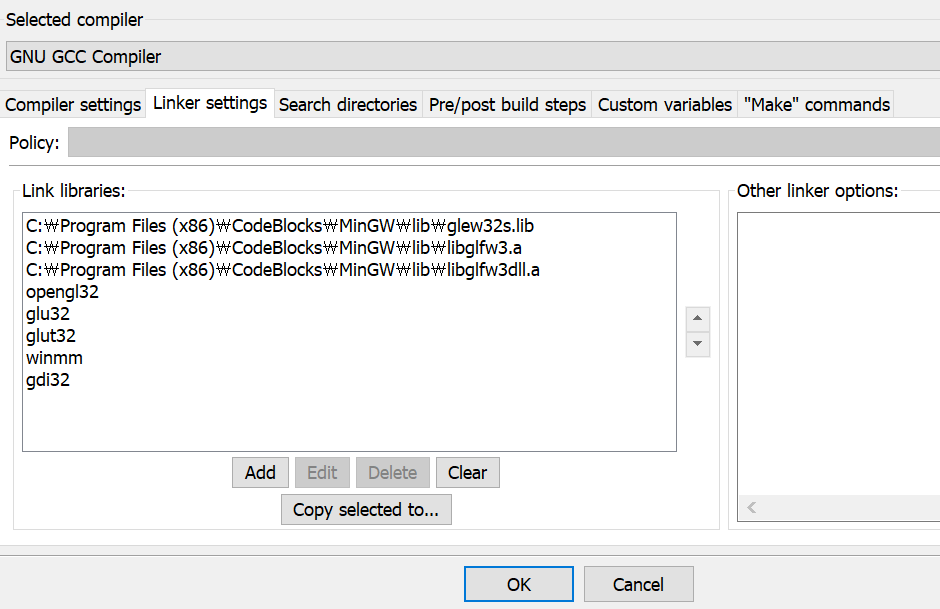

# object file loader in OpenGL with Code::Blocks

- [OpenGl Tutorial](http://www.opengl-tutorial.org/kr/beginners-tutorials/tutorial-7-model-loading/)에서 제공하는 코드를 ``Code::Blocks``에 맞게 수정하였다.

## 준비 사항

1. ``Code::Blocks`` 설치 (윈도우 기준으로 설명)
2. 아래의 라이브러리를 모두 설치한다.

```
glfw3.h
glew.h
gl.h
```

3. 해당 라이브러리 설치 방법은 다음과 같다.
    1. 인터넷에 원하는 라이브러리를 다운 받는다.
    2. 라이브러리 파일(``.lib or .a``)는 ``[코드블럭 설치 경로]\MinGW\lib`` 에 위치 시킨다.
    3. 헤더 파일 ( ``.h or .hpp``)는 ``[코드블럭 설치 경로]\MinGW\include\GL`` ( ``glfw3.h`` 는 ``[코드블럭 설치 경로]\MinGW\include\GLFW`` 에 위치 시킨다.
    4. dll 파일은 ``C:\Windows\System32`` 와 ``C:\Windows\SysWOW64``에 모두 위치 시킨다.

4. 원하는 obj 파일, ddl 이미지와 ``TextureFragmentShader.fragmentshader`` , ``TransformVertexShader.vertexshader``을 모두 ``[코드블럭 설치 경로]\MinGW\include\bin`` 에 위치 시킨다.

### 실행

- ``glut`` 새 프로젝트 를 생성하고 ``main.cpp`` 와 ``common\*`` 을 옮긴다.
- ``common`` 폴더에 위치한 헤더 파일은 모두 빌드 옵션에서 컴파일로 설정한다.
- 해당 프로젝트를 우클릭하여 Properties> Projects build options>linker settings 탭에 들어가서 add 버튼을 통해 아래의 사진과 등록한다. 

```diff
- 순서가 매우 중요하다. 꼭 glew32s.lib가 맨 앞에 위치해야한다.
```




### 주의할 점

``main.cpp`` 코드 변경시 ``#define GLEW_STATIC`` 가 ``#include <GL/glew.h>`` 보다 앞에 작성되어야한다.
